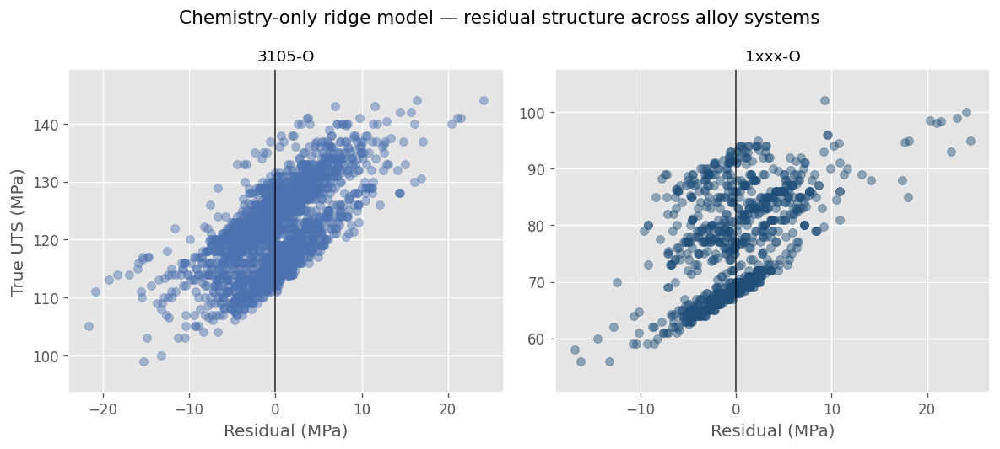

# Study Case 3 — Generalization Across Systems

**Chemistry-Only Modeling Beyond a Single Alloy**

---

## Position in the Portfolio

This study case builds directly on **Study Case 2**, which established a chemistry-only baseline for UTS prediction in AA3105-O using group-aware validation and conservative design reasoning.

Study Case 3 addresses a critical industrial risk:

> “A model works for one alloy system. Does the same approach hold for others?”

Rather than introducing new modeling techniques, this study focuses on **generalization**, assessing whether the chemistry-only hypothesis remains valid across different alloy systems and how the underlying chemistry–property relationship changes.

By keeping the modeling pipeline fixed and changing only the alloy system, this study isolates differences in chemistry–property behavior from methodological artifacts.

---

## Core Question

**Does a chemistry-only modeling approach generalize across alloy systems, and how does the functional relationship between chemistry and UTS vary between them?**

---

## Thesis

The chemistry-only approach generalizes across alloy systems in the sense that, for alloys of similar metallurgical nature, chemistry consistently defines the feasible strength envelope.

However, the functional relationship between chemistry and UTS is system-dependent.
While some alloy systems are well approximated by linear behavior within their operational domain, others exhibit subtle non-linear effects driven by system-specific metallurgical behavior.

This distinction is critical for engineering practice: generalization of a modeling *approach* does not imply invariance of the optimal functional *representation*.

---

## Scope and Constraints

### In scope
- Chemistry-only feature sets, extracted from the same semantic layer used in SC2
- UTS prediction at heat level as the primary target
- Group-aware validation to ensure generalization to unseen heats
- Comparison of representative functional forms (not exhaustive model tuning)
- Interpretability sufficient to support metallurgical and engineering reasoning

### Out of scope (explicit)
- Introduction of process, geometry, or route variables
- Exhaustive hyperparameter tuning or model selection sweeps
- Advanced ML models (e.g., boosting, neural networks)
- Probabilistic uncertainty calibration (deferred to later study cases)

The goal is **not optimization**, but structural understanding and **transferability**. The focus is on model reuse and structural transferability.

---

## Systems Under Study

This study focuses on aluminum alloy systems with differing metallurgical behavior:

- **AA3105-O** — reference system from SC2
- **AA1050-O** — commercially pure aluminum
- **AA1100-O** — commercially pure aluminum, closely related to AA1050

AA1050 and AA1100 are analyzed both independently and jointly, reflecting part of their overlapping chemistry and mechanical property ranges.

---

## Data Inputs (from the semantic layer)

- Heat-level chemistry composition records
- Heat-level mechanical test results providing UTS values
- Consistent grain guarantees and joins inherited from SC1

**Assumptions:**
- One row per heat after aggregation
- Chemistry values fall within validated operational ranges
- Differences between systems are driven primarily by composition–property physics, not data artifacts

---

## Method Overview

### Pipeline reuse
- Reuse the full SC2 pipeline: extraction, aggregation, validation, diagnostics
- Ensure comparability across systems by keeping methodology fixed

### Baseline functional form
- Linear / ridge regression used as a common reference across all systems

### Alternative functional representation
- Introduce a limited set of non-linear transformations (e.g., second-order polynomial or logarithmic)
- Selection driven by observed behavior and metallurgical plausibility, not tuning

### Validation and diagnostics
- GroupKFold evaluation
- Out-of-fold error analysis and residual diagnostics
- Comparison of error magnitude, stability, and structure across systems

### Residual structure across alloy systems

To assess whether differences between alloy systems arise from modeling artifacts or from underlying metallurgy, the same ridge-based chemistry-only model was applied unchanged across systems.

The figure below shows out-of-fold residuals versus true UTS for each alloy system:

**Interpretation:**
- AA3105 exhibits a compact, approximately symmetric residual structure.
- Commercially pure alloys (AA1050 / AA1100) show stratification and curvature,   indicating system-specific chemistry–UTS behavior.
- This confirms that while the modeling *approach* generalizes, the functional
  relationship does not remain invariant across systems.

---

## Expected Outputs

### Tables
- Model performance comparison by system (MAE, RMSE, R²; out-of-fold)
- Summary of dominant chemistry drivers per system
- Relative error magnitude as a proxy for unmodeled effects

### Figures
- Actual vs predicted (out-of-fold) by system
- Residual diagnostics highlighting structural differences

### Engineering insights
- Identification of systems where linear assumptions are sufficient
- Identification of systems where curvature matters
- Clear boundaries on what chemistry-only models can and cannot support

---

## Evaluation Criteria

The study is considered successful if it demonstrates:

- Generalization of the chemistry-only hypothesis across systems
- System-dependent functional behavior consistent with metallurgical understanding
- Stable, unbiased out-of-fold errors suitable for conservative interpretation
- Actionable engineering insight, not just metric improvement
- Clear evidence that model choice and functional form must be selected on a system-by-system basis, rather than assumed to transfer unchanged across alloys

**Not considered success criteria:**
- Maximum predictive accuracy
- Complex models with limited interpretability
- Marginal gains that do not change engineering decisions

---

## Exit Condition

Study Case 3 is complete when:

- The SC2 pipeline has been successfully reused across multiple alloy systems
- Generalization of the chemistry-only *approach* is demonstrated
- Differences in chemistry–UTS functional behavior are clearly identified and linked to system-specific metallurgical effects
- The limits of model reuse are explicitly defined in terms of functional form and engineering applicability

---

## Relationship to Next Study Case

Study Case 3 establishes that while chemistry consistently defines strength envelopes, it cannot fully explain where a given heat lands within that envelope.

**Study Case 4** will build on this conclusion by introducing process variables to quantify how much of the remaining uncertainty can be reduced and under what conditions added complexity delivers real engineering value.
