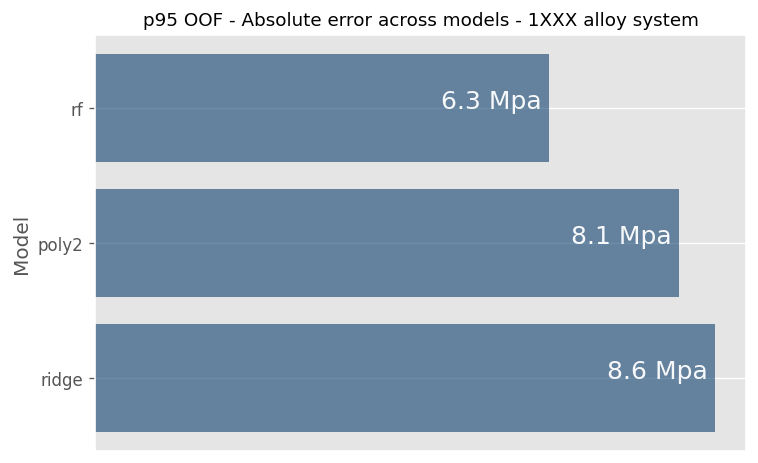
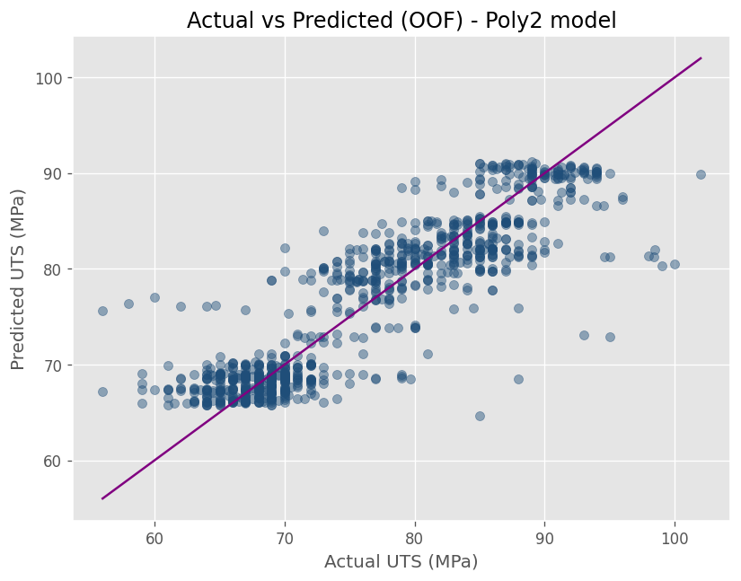

# SC03 — Chemistry-Only Modeling: Generalization Across Alloy Systems

> **Chemistry-based models do not generalize as fixed formulas, but as a repeatable decision framework whose functional form is system-dependent.**

---

## 1. Why This Study Case Exists

After establishing in **SC02** that chemical composition model contains sufficient signal to initiate **internal UTS standards** for AA3105-O, a critical question remains unanswered:

> **Do chemistry-based models generalize across alloy systems, or are they inherently system-specific?**

In industrial practice, a common failure mode occurs when:
- A model performs well for one alloy
- It is transferred to another system with minimal adaptation
- Degradation occurs silently, often detected only through downstream failures   

This study case exists to evaluate whether the **chemistry-only modeling framework itself generalizes**, even if the **optimal functional representation does not**.

---

## 2. Problem Framing and Hypothesis

### Strategic Problem

A modeling framework is valuable only if it:
- Remain valid across material families, **or**
- Explicitly signal when adaptation is required

Blindly transferring chemistry-property relationships across alloy systems introduces hidden risk.

The strategic question addressed here is therefore:

> **Does the chemistry-only modeling framework remain valid across alloy systems, and what changes when it does not?**

### Hypothesis

> *The chemistry-only modeling framework generalizes structurally across alloy systems, but the optimal functional form of the chemistry-UTS relationship is system-dependent.*

---

## 3. Modeling Philosophy and Design Principles

This study deliberately **reuses the full analytical pipeline from SC02**.

No tuning, no feature expansion, no methodological changes.

This is intentional.

### Core Principle: Fixed Method, Variable Physics

By holding constant:
- Data grain (heat-level)
- Validation strategy (GroupKFold)
- Feature set
- Model families

Any observed differences can be attributed to **metallurgical behavior**, not analytical artifacts.

---

## 4. Methodological Decisions (What We Chose — and Why)

- **Alloy systems:** AA1050-O and AA1100-O, treated as a single 1xxx-O family
- **Features:** Fe and Si only
- **Target:** UTS at heat level
- **Validation:** Group-aware cross-validation by heat
- **Models evaluated:**
  - Ridge (linear baseline)
  - Polynomial (degree 2)
  - Random Forest (high-flexibility reference)

> Portfolio-wide assumptions and conventions are documented in  
> → [`README_EXTENDED.md`](https://github.com/ivvza-io/analytics-engineering-portfolio/blob/main/docs/README_EXTENDED.md)  
> Design rationale and technical details: [`docs/technical_notes.md`](docs/technical_notes.md)  
>  
> This study case uses the [`portfolio-analytics-toolkit`](https://github.com/ivvza-io/portfolio-analytics-toolkit) for reusable CV, metrics, and plotting utilities.  
>  
> Reproducibility instructions: [`HOW_TO_RUN.md`](HOW_TO_RUN.md)
---

## 5. Key Results and Evidence

### 5.1 Domain of Applicability (1xxx-O System)

**Table 1 — Chemistry and UTS domain (1xxx-O, heat-level)**

| Variable | Min | P01 | P50 | P99 | Max |
|--------|-----|-----|-----|-----|-----|
| Fe (%) | 0.070 | 0.080 | 0.180 | 0.490 | 0.540 |
| Si (%) | 0.003 | 0.006 | 0.063 | 0.161 | 0.170 |
| UTS (MPa) | 56 | 61 | 76 | 95 | 102 |

*This domain differs significantly from AA3105-O in both chemistry nature and range, and mechanical response.*

---

### 5.2 Cross-Validated Performance - Central Tendency

**Table 2 — Out-of-fold performance summary (median values)**

| Model | MAE (MPa) | RMSE (MPa) | R² |
|------|-----------|------------|----|
| Random Forest | 2.2 | 3.3 | 0.9 |
| Polynomial (deg 2) | 2.9 | 4.1 | 0.8 |
| Ridge | 3.3 | 4.5 | 0.8 |

Key observations:
- All models retain **meaningful predictive signal**
- Differences in median MAE are moderate
- Central metrics alone do **not** explain robustness differences

**Design decision:**   
Although tree-based models achieve superior raw error metrics, they were not selected as the basis for future design tools.
For standard definition, robustness, **interpretability**, and stability of the **response surface** were prioritized over marginal accuracy gains.

---

### 5.3 Robustness and Tail Behavior

Central tendency metrics alone are insufficient for evaluating the suitability of models for internal standards.   
Robustness under tail behavior provides a more reliable basis for conservative decision-making.

**Table 3 — Out-of-fold p95 absolute error**

| Model | P95 absolute error (MPa) |
|------|--------------------------|
| Random Forest | 6.5 |
| Polynomial (deg 2) | 8.2 |
| Ridge | 8.8 |

**Figure 1 — P95 absolute error across models**  

> *Tail behavior reveals clearer separation between model families than median MAE, highlighting robustness rather than accuracy as the dominant differentiator.*

This result mirrors SC02 in principle, but **differs in magnitude and structure**.

---

### 5.4 Reliability Diagnostics

**Figure 2 — Out-of-fold Actual vs Predicted (Polynomial model)**  

> *Introducing limited non-linearity alters how error is distributed across the chemistry space, without fundamentally changing signal strength.*

---

### 5.5 Driver Hierarchy and Plausibility

**Table 4 — Permutation importance (absolute mean)**

| Feature | Ridge | Poly2 | RF |
|-------|-------|-------|----|
| Fe | 0.704 | 1.609 | 2.451 |
| Si | 0.206 | 0.070 | 0.324 |

Key observations:
- Fe consistently emerges as the dominant driver
- Si acts as a secondary modifier
- Driver hierarchy is stable across model families

This reinforces metallurgical plausibility while revealing system-specific interactions.

---

## 6. Interpretation: What This Means for Decisions

This study clarifies a critical distinction:

> **Generalization of a standardization framework does not imply invariance of the optimal model or its functional form.**

In practice:
- Chemistry continues to define the feasible UTS envelope
- However, the *shape* of that envelope is system-dependent
- Linear models may be sufficient in some alloys
- Limited non-linearity improves robustness in others

Internal standards must therefore be:
- **System-aware**
- **Robustness-driven**
- **Adaptable in functional form**

---

## 7. What This Model Is — and Is Not

### This Model *Is* :
- A validation of the **chemistry-only modeling framework**
- A diagnostic for system-dependent behavior
- A guide for selecting appropriate functional complexity

### This Model *Is Not* :
- A universal chemistry-UTS equation
- A transferable standard without adaptation
- A replacement for metallurgical judgment

---

## 8. Limitations, Risks, and Failure Modes

- Fe and Si capture dominant trends but not all strengthening mechanisms
- Small chemistry variations can induce non-linear effects in 1xxx systems
- Over-simplified modeling risk masking interaction effects
- Historical domains constrain model validity

These risks motivate explicit evaluation of **process variables** in the next study case.

---

## 9. Why This Study Case Matters in the Portfolio

This study case demonstrates that:

1. For this alloy systems, chemistry-based modeling can generalize **methodologically**
2. Functional form must remain **system-specific**
3. Robustness and tail behavior should guide standard design

Generalization in this context means reusing the analytical workflow, validation discipline, and decision criteria — not transferring coefficients, thresholds, or functional forms across systems.

It serves as the bridge between:
- **SC02:** feasibility of chemistry-based standards
- **SC04:** deciding what additional variables justify inclusion
- **SC05:** translating standards into uncertainty-aware tools

---

## 10. Next Steps

- Identify which process variables explain deviations within chemistry-defined envelopes (→ SC04)
- Quantify ROI of added complexity before expanding standards
- Preserve interpretability while improving robustness

---

## References and Related Work

- Portfolio assumptions and conventions:  
  → [`README_EXTENDED.md`](https://github.com/ivvza-io/analytics-engineering-portfolio/blob/main/docs/README_EXTENDED.md)
- Chemistry-only standard definition (single system):  
  → [`SC02 — Chemistry-Only Modeling of UTS`](https://github.com/ivvza-io/sc02-chemistry-only-mechanical-properties)
- Variable influence screening:  
  → [`SC04 — Variable Influence Screening`](https://github.com/ivvza-io/sc04-variable-influence-screening)

---

### Takeaway

This study shows that **models generalize as frameworks, not formulas**.  
Chemistry consistently defines the strength envelope, but **how** that envelope is represented must respect system-specific behavior.
